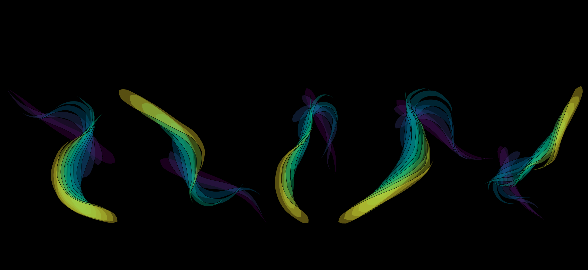

*swimming_analysis_project_and_report*

# Swimming analysis : project and report



## Overview

**Resume of the study**:

Morphology is a major physical constraint on fish locomotion. Several swimmers morphotypes are described because of their specialisation in distinct environment with different swimming capacities (periodic swimming, cruisers, manoeuvrers). Therefore, assessing correct differences in fish performances can become a real challenge when observed at the micro-evolutive scale with similar morphology. Here we tried to evaluate possible differences in the steady/unsteady swimming of the species Salmo trutta facing different flow regimes conditions. As floods are predicted to increase in term of intensity and frequency, we tried to detect the impact of this increase through animal experimentation. One group faced fluctuant flow regime while the other stayed in stable conditions. We collected data on steady swimming against a constant flow, and on unsteady swimming mixing behaviour, kinematics and induced escape reactions (fast-start). We measured several performance and behaviour metrics to evaluate the best potential in detecting differences across treatment. Genetic lineage was also considered with high influence factor as the first batch of individuals collected were reared trout and the other one from wild origin. Statistical analysis and modelling showed no significant enough metric to distinct clearly between origin nor treatment for the steady swimming and the behaviour analysis. However, statistical modelling showed high significant importance of genetic origin in fast-start actuation across time suggesting better performances of the wild trout in the early stage of fast start. Treatment remained undetected as a discriminative factor in all analysis suggesting that the treatment was not intense enough or that the experimental conditions allow individuals to find shelters in the semi-natural environment and avoid the treatment effect. This could also indicates high robustness of the developmental patterns. Results could be valuable to pre-evaluate repopulations efficiency of Salmonidae populations in river ecosystems.

**Keywords**: Morpho-functionality, Swimming performances/kinematics, Steady/unsteady performances, Salmo trutta, Micro-evolution

Here is shared: the data used for the analysis, the code for statistical analysis and modelling, the code for using the segmentation algorithm, the code for fast-start animation, the protocols and description of each project (data extraction, data acquisition, analysis of steady swimming, analysis of unsteady behaviour, analysis of fast-start, comparison of digitising method, and the segmentation method).

Softwares/languages used (**R**, **Python**, **MATLAB**, **ImageJ**, **Avidemux**, **EthoVisionXT**)

------------------------------------------------------------------------

## Repository structure

``` text
swimming_analysis_project_and_report/
│
├── 00_documents/                             # reports and presentation
├── 01_fast_start_extraction/                 # workflow for extracting the fast-start sequences
├── 02_fast_start_acquisition/                # workflow to digitize the fast-start sequences using MATLAB
├── 03.1_ImageJ_acquisition/                  # workflow to digitize the fast-start sequences using ImageJ for method comparison
├── 03.2_MATLAB_acquisition/                  # workflow to digitize the fast-start sequences using MATLAB for method comparison
├── 03.3_R_comparison_digitalization_method/  # project to compare variability of the digitizing method
├── 04_Python_segmentation_algorithm/         # workflow to create segmentation of the fish kinematics
├── 05_R_analysis_Ptut                        # project to analyse steady swimming <UPPA students>
├── 06_R_fast_start_analysis.R                # project to analyse fast start variability
├── 07_EthoVisionXT_information               # workflow and parameters to use EthoVisionXT tracking software
├── 08_R_tracking_EthoVisionXT_analysis       # project to analyse behaviour variability
├── 09_R_fish_silhouette_animation            # workflow to animate fish kinematics during behaviour/fast start events
├── README_FR.md                              # french version
└── README_ENG.md
```


------------------------------------------------------------------------

## Additional Information

The study report `00_documents/Study of the effect of hydrological events on the steady unsteady swimming perfomances of Salmo trutta - Guillaud Felix.pdf` documents the work and analyses carried out during this project, including all information and resources required to perform the analyses. Additionally, two `.pdf` presentations are provided: one summarizing the method comparison (benchmark) and the other outlining the study as a whole. Two `.RSTHEME` files are also included for optional use (these only modify the appearance of RStudio).

Each folder/directory is structured consistently to facilitate reproducibility and includes a *README* description in either french or english version.

The `05_R_analysis_Ptut` directory was created and developed as part of a collaborative project between INRAE and students from UPPA University.

------------------------------------------------------------------------

## Author

Felix Guillaud

Mail: [felix.guillaud.work\@gmail.com](mailto:felix.guillaud.work@gmail.com){.email}

## License

This project is distributed Under the MIT license.
